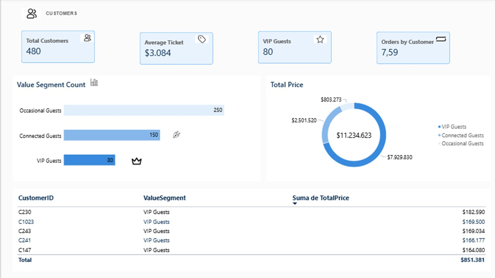
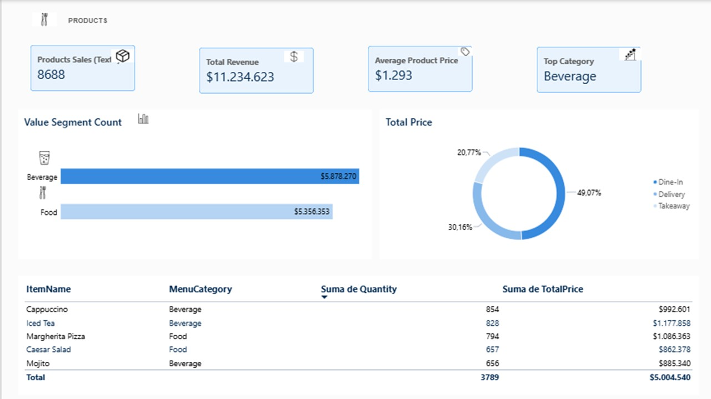
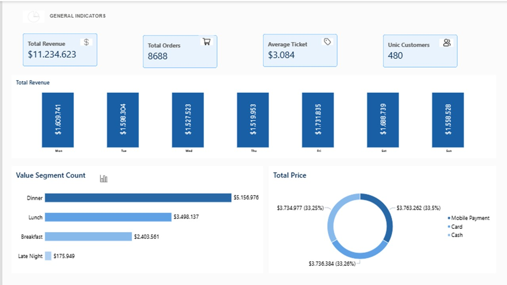

# Restaurante

Este proyecto es creado con el fin de analizar la data de un restaurante.

Este dashboard analiza el comportamiento y la segmentación de 480 clientes.

En total, se generaron $11.234.623 en ventas, con un ticket promedio
de $3.084 por orden y un promedio de 7,59 órdenes por cliente.

Los clientes fueron clasificados en tres segmentos: VIP Guests,
Connected Guests y Occasional Guests, teniendo en cuenta su recurrencia, cantidad de órdenes y valor de compra.

Aunque los Occasional Guests representan el grupo más numeroso,
con 250 clientes, son los que generan el menor valor de ventas.

En contraste, los VIP Guests, a pesar de ser únicamente 80 clientes,
concentran el mayor nivel de ingresos.

Esto evidencia que la cantidad de clientes no necesariamente se
traduce en mayores ingresos, ya que la frecuencia de compra y el
valor generado por cada cliente tienen un papel fundamental.

Este dashboard analiza el comportamiento de las ventas de los productos del restaurante.

Se registraron 8.688 unidades vendidas, generando un ingreso total de $11.234.623, con un precio promedio por unidad de $1.293.

La categoría Beverage generó el mayor valor de ventas, con $5.878.270, superando moderadamente a la categoría Food, que alcanzó $5.356.353.

En cuanto a la modalidad de consumo, Dine-In concentra el mayor porcentaje de las ventas, con un 49,07 %, seguido de Delivery y Takeaway.

Al analizar el Top 5 de productos, se observa una diferencia interesante entre cantidad e ingresos: el Iced Tea es el producto que genera el mayor valor de ventas, mientras que el Capuccino registra la mayor cantidad de unidades vendidas.

Los cinco productos del Top 5 generaron ingresos totales de $5.004.540, lo que representa el 44,5 % del total de las ventas.

